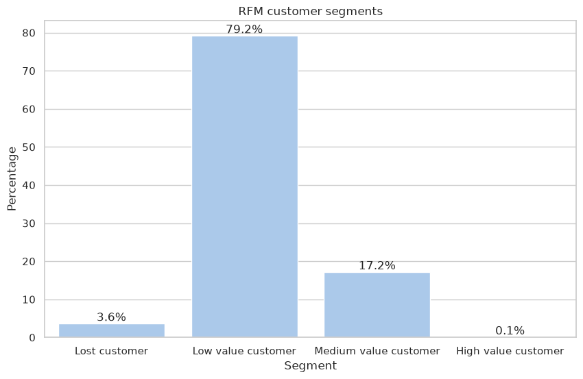
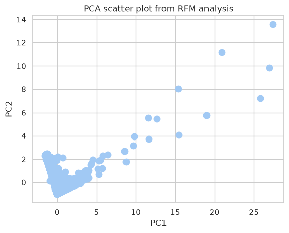
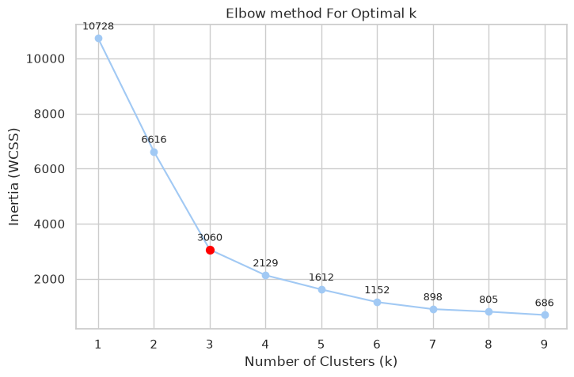
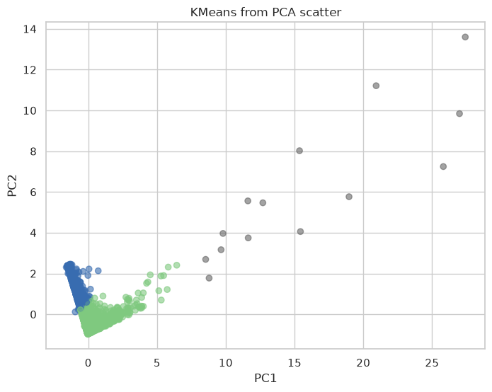

This is a transactional data set which contains all the transactions occurring between 01/12/2010 and 09/12/2011 for a UK-based and registered non-store online retail.The company mainly sells unique all-occasion gifts. Many customers of the company are wholesalers.

| Variable Name | Role | Type | Description | Units | Missing Values |
| :--- | :--- | :--- | :--- | :--- | :--- |
| `invoice_number` | ID | Categorical | a 6-digit integral number uniquely assigned to each transaction. If this code starts with letter 'c', it indicates a cancellation | | no |
| `stock_code` | ID | Categorical | a 5-digit integral number uniquely assigned to each distinct product | | no |
| `description` | Feature | Categorical | product name | | no |
| `quantity` | Feature | Integer | the quantities of each product (item) per transaction | | no |
| `invoice_date` | Feature | Date | the day and time when each transaction was generated | | no |
| `unit_price` | Feature | Continuous | product price per unit | sterling | no |
| `customer_id` | Feature | Categorical | a 5-digit integral number uniquely assigned to each customer | | no |
| `country` | Feature | Categorical | the name of the country where each customer resides | | no |
```python
!uv add scikit-learn pandas numpy matplotlib seaborn mlxtend
```

```text
warning: `VIRTUAL_ENV=/home/harry/.cache/uv/archive-v0/Zpwzgn8EFH5XDawT7jIu6` does not match the project environment path `.venv` and will be ignored; use `--active` to target the active environment instead
Resolved 52 packages in 1ms
Audited 20 packages in 0.03ms
```

```python
import pandas as pd
import matplotlib.pyplot as plt
import seaborn as sns

from datetime import datetime

sns.set_theme(style='whitegrid', palette='pastel')
```

```python
df = pd.read_csv("dataset_online_retail.csv")
df.info()
```

```text
<class 'pandas.DataFrame'>
RangeIndex: 541909 entries, 0 to 541908
Data columns (total 8 columns):
 #   Column       Non-Null Count   Dtype  
---  ------       --------------   -----  
 0   InvoiceNo    541909 non-null  str    
 1   StockCode    541909 non-null  str    
 2   Description  540455 non-null  str    
 3   Quantity     541909 non-null  int64  
 4   InvoiceDate  541909 non-null  str    
 5   UnitPrice    541909 non-null  str    
 6   CustomerID   406829 non-null  float64
 7   Country      541909 non-null  str    
dtypes: float64(1), int64(1), str(6)
memory usage: 33.1 MB
```

```python
df = df.rename(columns={
    'InvoiceNo': 'invoice_number',
    'StockCode': 'stock_code',
    'Description': 'description',
    'Quantity': 'quantity',
    'InvoiceDate': 'invoice_date',
    'UnitPrice': 'unit_price',
    'CustomerID': 'customer_id',
    'Country': 'country',
})
df.info()
```

```text
<class 'pandas.DataFrame'>
RangeIndex: 541909 entries, 0 to 541908
Data columns (total 8 columns):
 #   Column          Non-Null Count   Dtype  
---  ------          --------------   -----  
 0   invoice_number  541909 non-null  str    
 1   stock_code      541909 non-null  str    
 2   description     540455 non-null  str    
 3   quantity        541909 non-null  int64  
 4   invoice_date    541909 non-null  str    
 5   unit_price      541909 non-null  str    
 6   customer_id     406829 non-null  float64
 7   country         541909 non-null  str    
dtypes: float64(1), int64(1), str(6)
memory usage: 33.1 MB
```

```python
df
```

```text
       invoice_number stock_code                          description  \
0              536365     85123A   WHITE HANGING HEART T-LIGHT HOLDER   
1              536365      71053                  WHITE METAL LANTERN   
2              536365     84406B       CREAM CUPID HEARTS COAT HANGER   
3              536365     84029G  KNITTED UNION FLAG HOT WATER BOTTLE   
4              536365     84029E       RED WOOLLY HOTTIE WHITE HEART.   
...               ...        ...                                  ...   
541904         581587      22613          PACK OF 20 SPACEBOY NAPKINS   
541905         581587      22899         CHILDREN'S APRON DOLLY GIRL    
541906         581587      23254        CHILDRENS CUTLERY DOLLY GIRL    
541907         581587      23255      CHILDRENS CUTLERY CIRCUS PARADE   
541908         581587      22138        BAKING SET 9 PIECE RETROSPOT    

        quantity      invoice_date unit_price  customer_id         country  
0              6  01/12/2010 08:26       2,55      17850.0  United Kingdom  
1              6  01/12/2010 08:26       3,39      17850.0  United Kingdom  
2              8  01/12/2010 08:26       2,75      17850.0  United Kingdom  
3              6  01/12/2010 08:26       3,39      17850.0  United Kingdom  
4              6  01/12/2010 08:26       3,39      17850.0  United Kingdom  
...          ...               ...        ...          ...             ...  
541904        12  09/12/2011 12:50       0,85      12680.0          France  
541905         6  09/12/2011 12:50        2,1      12680.0          France  
541906         4  09/12/2011 12:50       4,15      12680.0          France  
541907         4  09/12/2011 12:50       4,15      12680.0          France  
541908         3  09/12/2011 12:50       4,95      12680.0          France  

[541909 rows x 8 columns]
```

# Preprocessing
```python
print(f"Null values count:\n{df.isna().sum()}")
```

```text
Null values count:
invoice_number         0
stock_code             0
description         1454
quantity               0
invoice_date           0
unit_price             0
customer_id       135080
country                0
dtype: int64
```

```python
def describe_column(df: pd.DataFrame, column_name: str):
    print(f"Column {column_name}:\nNull values:\t{df[column_name].isna().sum()}\nType:\t\t{df[column_name].dtype}")
```

```python
# drop invoices with null description
df = df.dropna(subset=['description'])
describe_column(df, 'description')
```

```text
Column description:
Null values:	0
Type:		str
```

```python
if df['unit_price'].dtype == 'str':
    # Pandas can only convert float values with '.' as decimal separator
    corrected_decimal_separator_unit_prices = df['unit_price'].str.replace(',', '.')

    df['unit_price'] = pd.to_numeric(corrected_decimal_separator_unit_prices, errors='coerce')

describe_column(df, 'unit_price')
```

```text
Column unit_price:
Null values:	0
Type:		float64
```

```python
if df['invoice_date'].dtype == 'str':
    df['invoice_date'] = pd.to_datetime(df['invoice_date'], format="%d/%m/%Y %H:%M", errors='coerce')
    
describe_column(df, 'invoice_date')
```

```text
Column invoice_date:
Null values:	0
Type:		datetime64[us]
```

```python
# none of the customer_id values have decimals
if df['customer_id'].dtype == 'float64':
    df['customer_id'] = df['customer_id'].astype('Int64')

describe_column(df, 'customer_id')
```

```text
Column customer_id:
Null values:	133626
Type:		Int64
```

# RFM indicator
```python
# auxiliary rfm functions
def build_rfm_dataframe(df: pd.DataFrame) -> pd.DataFrame:
    df_with_invoice_total = df.copy()
    df_with_invoice_total['invoice_total'] = df['unit_price'] * df['quantity']

    max_invoice_date = df['invoice_date'].max()

    result = df_with_invoice_total.groupby('customer_id', as_index=True).agg(
        last_invoice_date=('invoice_date', 'max'),
        recency=('invoice_date', lambda date: (max_invoice_date - date.max()).days),
        frequency=('invoice_date', 'count'),
        monetary=('invoice_total', 'sum')
    )

    result['rfm_score'] = get_rfm_score(result)
    
    result['customer_segment'] = pd.cut(
        result['rfm_score'],
        bins=[0, 1.6, 3, 4, 5],
        labels=["Lost customer", "Low value customer", "Medium value customer", "High value customer"]
    )
    
    return result

def get_rfm_score(df: pd.DataFrame) -> pd.DataFrame:
    result = pd.DataFrame()

    result['recency_rank'] = df['recency'].rank(ascending=False).astype(int)
    result['frequency_rank'] = df['frequency'].rank(ascending=True).astype(int)
    result['monetary_rank'] = df['monetary'].rank(ascending=False).astype(int)

    result['recency_rank_norm'] = (result['recency_rank'] / result['recency_rank'].max()) * 100
    result['frequency_rank_norm'] = (result['frequency_rank'] / result['frequency_rank'].max()) * 100
    result['monetary_rank_norm'] = (result['monetary_rank'] / result['monetary_rank'].max()) * 100

    result.drop(columns=['recency_rank', 'frequency_rank', 'monetary_rank'], inplace=True)

    RFM_RECENCY_WEIGHT = 0.15
    RFM_FREQUENCY_WEIGHT = 0.28
    RFM_MONETARY_WEIGHT = 0.57

    result['rfm_score'] = (
        RFM_RECENCY_WEIGHT * result['recency_rank_norm'] + 
        RFM_FREQUENCY_WEIGHT * result['frequency_rank_norm'] + 
        RFM_MONETARY_WEIGHT * result['monetary_rank_norm']
    ) * 0.05

    return result['rfm_score'].round(2)
ase II. Modelado predictivo para la detección de fraude:
```

```python
rfm_df = build_rfm_dataframe(df)
rfm_df.describe()
```

```text
                last_invoice_date      recency    frequency       monetary  \
count                        4372  4372.000000  4372.000000    4372.000000   
mean   2011-09-08 23:12:06.697163    91.047118    93.053294    1898.459701   
min           2010-12-01 09:53:00     0.000000     1.000000   -4287.630000   
25%           2011-07-19 15:21:30    16.000000    17.000000     293.362500   
50%           2011-10-20 15:56:30    49.000000    42.000000     648.075000   
75%           2011-11-23 09:29:30   142.000000   102.000000    1611.725000   
max           2011-12-09 12:50:00   373.000000  7983.000000  279489.020000   
std                           NaN   100.765435   232.471608    8219.345141   

         rfm_score  
count  4372.000000  
mean      2.504938  
min       0.430000  
25%       2.140000  
50%       2.490000  
75%       2.872500  
max       4.410000  
std       0.520581  
```

```python
plt.figure(figsize=(10, 6))

ax = sns.countplot(
    data=rfm_df,
    x='customer_segment', 
    order=["Lost customer", "Low value customer", "Medium value customer", "High value customer"],
    stat="percent"
)

ax.bar_label(ax.containers[0], fmt="%.1f%%")

plt.title('RFM customer segments')
plt.xlabel('Segment')
plt.ylabel('Percentage')

plt.show()
```



# PCA analysis
```python
from sklearn.decomposition import PCA
from sklearn.preprocessing import StandardScaler
```

```python
rfm_df_scaled = StandardScaler().fit_transform(rfm_df[['recency', 'frequency', 'monetary']])

pca = PCA(n_components=2)
rfm_pca = pca.fit_transform(rfm_df_scaled)

print('Explained variance ratio per component:', pca.explained_variance_ratio_.round(3))
print('Total explained variance:', pca.explained_variance_ratio_.sum().round(3))

plt.scatter(rfm_pca[:,0], rfm_pca[:,1], s=80)
plt.xlabel('PC1')
plt.ylabel('PC2')
plt.title('PCA scatter plot from RFM analysis')
plt.show()
```

```text
Explained variance ratio per component: [0.517 0.301]
Total explained variance: 0.818
```



# KMeans clustering
```python
from sklearn.cluster import KMeans
```

```python
k_range = range(1, 10)
```

## Elbow method
```python
inertia_values = []

for k in k_range:
    kmeans = KMeans(n_clusters=k, n_init='auto', random_state=42)
    kmeans.fit(rfm_pca)

    inertia_values.append(kmeans.inertia_)

chosen_k = 3

plt.figure(figsize=(8, 5))
plt.plot(k_range, inertia_values, marker='o', linestyle='-', color='b')

for k, e in zip(k_range, inertia_values):
    plt.annotate(f'{e:.0f}', (k, e), textcoords='offset points',
                 xytext=(0, 8), ha='center', fontsize=9)

# highlight chosen k
plt.scatter(chosen_k, inertia_values[chosen_k - 1], color='red', s=50, zorder=2)

plt.title('Elbow method For Optimal k')
plt.xlabel('Number of Clusters (k)')
plt.ylabel('Inertia (WCSS)')
plt.xticks(k_range)
plt.grid(True)
plt.show()
```



## Silhouette score
```python
from sklearn.metrics import silhouette_score
```

```python
for k in range(2, 11):
    cluster = KMeans(n_clusters=k, n_init=10, random_state=42).fit_predict(rfm_pca)
    print(f'k: {k}\tsilhouette:\t{silhouette_score(rfm_pca, cluster):.3f}')
```

```text
k: 2	silhouette:	0.928
k: 3	silhouette:	0.624
k: 4	silhouette:	0.631
k: 5	silhouette:	0.609
k: 6	silhouette:	0.551
k: 7	silhouette:	0.516
k: 8	silhouette:	0.468
k: 9	silhouette:	0.467
k: 10	silhouette:	0.455
```

```python
pca_df = pd.DataFrame(data=rfm_pca, columns=['pc1', 'pc2'])

kmeans = KMeans(n_clusters=3, random_state=42, n_init='auto')
pca_df['cluster'] = kmeans.fit_predict(rfm_pca)

plt.figure(figsize=(8, 6))

scatter = plt.scatter(
    pca_df['pc1'], 
    pca_df['pc2'], 
    c=pca_df['cluster'], 
    cmap='Accent', 
    alpha=0.6
)

plt.title('KMeans from PCA scatter')
plt.xlabel('PC1')
plt.ylabel('PC2')
plt.show()
```



# Apriori association
```python
from mlxtend.preprocessing import TransactionEncoder
from mlxtend.frequent_patterns import apriori
```

```python
valid_invoices_df = df[
    (df['invoice_number'].str.startswith('C') == False) &
    (df['description'].notna()) &
    (df['quantity'] > 0)
].copy()

basket = valid_invoices_df \
    .groupby(['invoice_number', 'invoice_date'])['description'] \
    .apply(list) \
    .reset_index()

transactions = basket['description'].tolist()
```

```python
te = TransactionEncoder()
te_array = te.fit(transactions).transform(transactions)
te_df = pd.DataFrame(te_array, columns=te.columns_)

frequent_itemsets = apriori(te_df, min_support=0.035, use_colnames=True)

print(f"Total frequent itemsets: {frequent_itemsets.shape[0]}")
```

```text
Total frequent itemsets: 91
```

```python
from mlxtend.frequent_patterns import association_rules

rules = association_rules(frequent_itemsets, metric='confidence', min_threshold=0.1)
rules = rules[
    rules['antecedents'].apply(lambda x: len(x) >= 1) &
    rules['consequents'].apply(lambda x: len(x) >= 1)
]

print("Association rules:", rules.shape[0])

rules[['antecedents', 'consequents', 'support', 'confidence', 'lift']].head(10)
```

```text
Association rules: 6
```

```text
                                     antecedents  \
0  frozenset({ROSES REGENCY TEACUP AND SAUCER })   
1   frozenset({GREEN REGENCY TEACUP AND SAUCER})   
2           frozenset({JUMBO BAG PINK POLKADOT})   
3           frozenset({JUMBO BAG RED RETROSPOT})   
4           frozenset({JUMBO BAG RED RETROSPOT})   
5            frozenset({JUMBO STORAGE BAG SUKI})   

                                     consequents   support  confidence  \
0   frozenset({GREEN REGENCY TEACUP AND SAUCER})  0.038061    0.720450   
1  frozenset({ROSES REGENCY TEACUP AND SAUCER })  0.038061    0.756650   
2           frozenset({JUMBO BAG RED RETROSPOT})  0.040837    0.676519   
3           frozenset({JUMBO BAG PINK POLKADOT})  0.040837    0.393881   
4            frozenset({JUMBO STORAGE BAG SUKI})  0.035782    0.345124   
5           frozenset({JUMBO BAG RED RETROSPOT})  0.035782    0.609797   

        lift  
0  14.322410  
1  14.322410  
2   6.525238  
3   6.525238  
4   5.881687  
5   5.881687  
```

