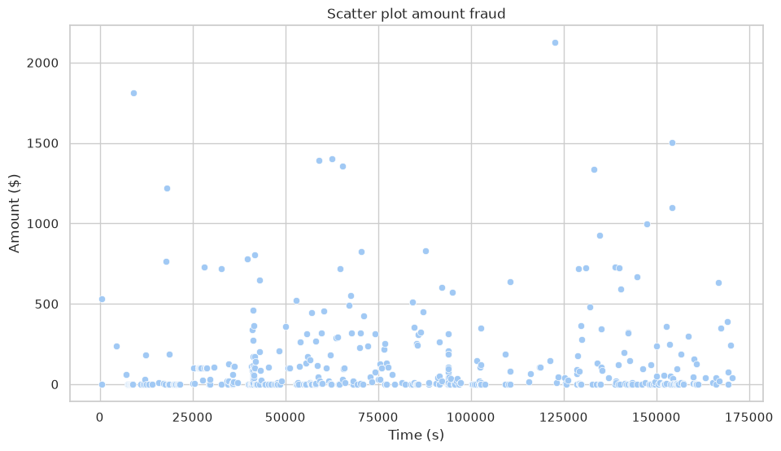
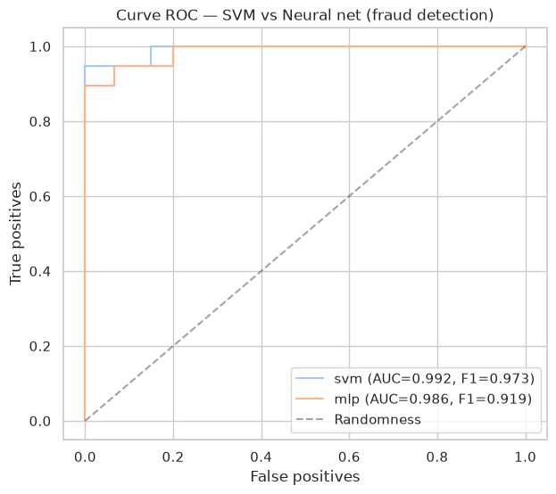
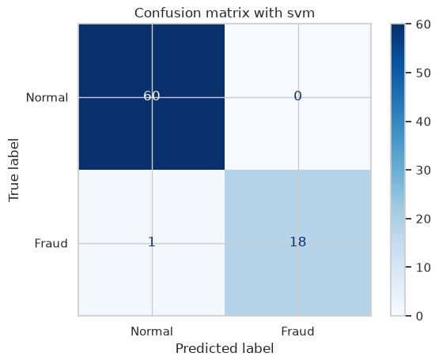

The dataset contains transactions made by credit cards in September 2013 by European cardholders. This dataset presents transactions that occurred in two days, where we have 492 frauds out of 284,807 transactions. The dataset is highly unbalanced, the positive class (frauds) account for 0.172% of all transactions.

It contains only numerical input variables which are the result of a PCA transformation. Unfortunately, due to confidentiality issues, we cannot provide the original features and more background information about the data. Features V1, V2, … V28 are the principal components obtained with PCA, the only features which have not been transformed with PCA are 'Time' and 'Amount'. Feature 'Time' contains the seconds elapsed between each transaction and the first transaction in the dataset. The feature 'Amount' is the transaction Amount, this feature can be used for example-dependant cost-sensitive learning. Feature 'Class' is the response variable and it takes value 1 in case of fraud and 0 otherwise.
```python
!uv add scikit-learn pandas numpy matplotlib seaborn
```

```text
Resolved 52 packages in 3ms
Audited 20 packages in 0.02ms
```

```python

import matplotlib.pyplot as plt
from sklearn import svm
import seaborn as sns
import pandas as pd
import numpy as np

import itertools

sns.set_theme(style='whitegrid', palette='pastel')
```

```python
df = pd.read_csv("dataset_credit_card_fraud.csv")
```

```python
df = df.rename(columns={
    'Time': 'time',
    'V1': 'v1',
    'V2': 'v2',
    'V3': 'v3',
    'V4': 'v4',
    'V5': 'v5',
    'V6': 'v6',
    'V7': 'v7',
    'V8': 'v8',
    'V9': 'v9',
    'V10': 'v10',
    'V11': 'v11',
    'V12': 'v12',
    'V13': 'v13',
    'V14': 'v14',
    'V15': 'v15',
    'V16': 'v16',
    'V17': 'v17',
    'V18': 'v18',
    'V19': 'v19',
    'V20': 'v20',
    'V21': 'v21',
    'V22': 'v22',
    'V23': 'v23',
    'V24': 'v24',
    'V25': 'v25',
    'V26': 'v26',
    'V27': 'v27',
    'V28': 'v28',
    'Amount': 'amount',
    'Class': 'class'
})
df.describe()
```

```text
                time            v1            v2            v3            v4  \
count  284807.000000  2.848070e+05  2.848070e+05  2.848070e+05  2.848070e+05   
mean    94813.859575  1.175161e-15  3.384974e-16 -1.379537e-15  2.094852e-15   
std     47488.145955  1.958696e+00  1.651309e+00  1.516255e+00  1.415869e+00   
min         0.000000 -5.640751e+01 -7.271573e+01 -4.832559e+01 -5.683171e+00   
25%     54201.500000 -9.203734e-01 -5.985499e-01 -8.903648e-01 -8.486401e-01   
50%     84692.000000  1.810880e-02  6.548556e-02  1.798463e-01 -1.984653e-02   
75%    139320.500000  1.315642e+00  8.037239e-01  1.027196e+00  7.433413e-01   
max    172792.000000  2.454930e+00  2.205773e+01  9.382558e+00  1.687534e+01   

                 v5            v6            v7            v8            v9  \
count  2.848070e+05  2.848070e+05  2.848070e+05  2.848070e+05  2.848070e+05   
mean   1.021879e-15  1.494498e-15 -5.620335e-16  1.149614e-16 -2.414189e-15   
std    1.380247e+00  1.332271e+00  1.237094e+00  1.194353e+00  1.098632e+00   
min   -1.137433e+02 -2.616051e+01 -4.355724e+01 -7.321672e+01 -1.343407e+01   
25%   -6.915971e-01 -7.682956e-01 -5.540759e-01 -2.086297e-01 -6.430976e-01   
50%   -5.433583e-02 -2.741871e-01  4.010308e-02  2.235804e-02 -5.142873e-02   
75%    6.119264e-01  3.985649e-01  5.704361e-01  3.273459e-01  5.971390e-01   
max    3.480167e+01  7.330163e+01  1.205895e+02  2.000721e+01  1.559499e+01   

       ...           v21           v22           v23           v24  \
count  ...  2.848070e+05  2.848070e+05  2.848070e+05  2.848070e+05   
mean   ...  1.628620e-16 -3.576577e-16  2.618565e-16  4.473914e-15   
std    ...  7.345240e-01  7.257016e-01  6.244603e-01  6.056471e-01   
min    ... -3.483038e+01 -1.093314e+01 -4.480774e+01 -2.836627e+00   
25%    ... -2.283949e-01 -5.423504e-01 -1.618463e-01 -3.545861e-01   
50%    ... -2.945017e-02  6.781943e-03 -1.119293e-02  4.097606e-02   
75%    ...  1.863772e-01  5.285536e-01  1.476421e-01  4.395266e-01   
max    ...  2.720284e+01  1.050309e+01  2.252841e+01  4.584549e+00   

                v25           v26           v27           v28         amount  \
count  2.848070e+05  2.848070e+05  2.848070e+05  2.848070e+05  284807.000000   
mean   5.109395e-16  1.686100e-15 -3.661401e-16 -1.227452e-16      88.349619   
std    5.212781e-01  4.822270e-01  4.036325e-01  3.300833e-01     250.120109   
min   -1.029540e+01 -2.604551e+00 -2.256568e+01 -1.543008e+01       0.000000   
25%   -3.171451e-01 -3.269839e-01 -7.083953e-02 -5.295979e-02       5.600000   
50%    1.659350e-02 -5.213911e-02  1.342146e-03  1.124383e-02      22.000000   
75%    3.507156e-01  2.409522e-01  9.104512e-02  7.827995e-02      77.165000   
max    7.519589e+00  3.517346e+00  3.161220e+01  3.384781e+01   25691.160000   

               class  
count  284807.000000  
mean        0.001727  
std         0.041527  
min         0.000000  
25%         0.000000  
50%         0.000000  
75%         0.000000  
max         1.000000  

[8 rows x 31 columns]
```

```python
fraud_df = df[df['class'] == 1]

ax = sns.scatterplot(
    data=fraud_df, 
    x='time', 
    y='amount'
)
ax.set_title("Scatter plot amount fraud")
ax.set_ylabel("Amount ($)")
ax.set_xlabel("Time (s)")
ax.figure.set_size_inches(11, 6)
```



```python
fraud_count = len(df[df['class'] == 1])
no_fraud_count = len(df[df['class'] == 0])
print(f"Fraud count:\t{fraud_count}\nNo fraud count:\t{no_fraud_count}")
```

```text
Fraud count:	492
No fraud count:	284315
```

```python
from sklearn.model_selection import train_test_split
from sklearn.pipeline import Pipeline         
from sklearn.preprocessing import StandardScaler    
from sklearn.svm import SVC                        
from sklearn.neural_network import MLPClassifier     
from sklearn.model_selection import GridSearchCV 
from sklearn.calibration import CalibratedClassifierCV
```

```python
undersampled_df_len = 30000

df_train_all = df[0:undersampled_df_len]

df_train_1 = df_train_all[df_train_all['class'] == 1]
df_train_0 = df_train_all[df_train_all['class'] == 0]

print('In this dataset, we have ' + str(len(df_train_1)) +" frauds so we need to take a similar number of non-fraud")

df_sample = df_train_0.sample(300)
df_train = pd.concat([df_train_1, df_sample])
df_train = df_train.sample(frac=1)

X = df_train.drop(columns=['time', 'class'])
y = df_train['class']

X_train, X_test, y_train, y_test = train_test_split(X, y, test_size=0.2, random_state=42, stratify=y)
```

```text
In this dataset, we have 94 frauds so we need to take a similar number of non-fraud
```

```python
candidates = {
    'svm': (
        Pipeline([
            ('scale', StandardScaler()),
            ('model', CalibratedClassifierCV(
                estimator=SVC(random_state=42), 
                method='sigmoid'
            ))
        ]),
        {
            'model__estimator__kernel': ['linear', 'rbf'],  
            'model__estimator__C': [0.1, 1, 10]
        } 
    ),
    'mlp': (
        Pipeline([
            ('escale', StandardScaler()),
            ('model', MLPClassifier(max_iter=600, random_state=42))
        ]),
        {
            'model__hidden_layer_sizes': [(32,), (64, 32)],
            'model__activation': ['relu', 'tanh']
        }
    ),
}
```

```python
queries = {}

for name, (pipe, grid) in candidates.items():
    gs = GridSearchCV(pipe, grid, cv=3, scoring='f1', n_jobs=-1)
    gs.fit(X_train, y_train)
    queries[name] = gs

    print(f'{name:20s} best: {gs.best_params_}  |  F1 (cv) = {gs.best_score_:.3f}')
```

```text
svm                  best: {'model__estimator__C': 10, 'model__estimator__kernel': 'rbf'}  |  F1 (cv) = 0.937
mlp                  best: {'model__activation': 'relu', 'model__hidden_layer_sizes': (32,)}  |  F1 (cv) = 0.937
```

```python
from sklearn.metrics import f1_score, roc_auc_score, roc_curve, confusion_matrix, ConfusionMatrixDisplay

plt.figure(figsize=(7,6))
for name, gs in queries.items():
    prob = gs.predict_proba(X_test)[:, 1]
    pred = gs.predict(X_test)

    f1, auc = f1_score(y_test, pred), roc_auc_score(y_test, prob)
    fpr, tpr, _ = roc_curve(y_test, prob)

    plt.plot(fpr, tpr, label=f'{name} (AUC={auc:.3f}, F1={f1:.3f})')
    print(f'{name:20s} F1 = {f1:.3f} | AUC-ROC = {auc:.3f}')
    
plt.plot([0,1],[0,1],'k--', alpha=0.4, label='Randomness')
plt.xlabel('False positives'); plt.ylabel('True positives')
plt.title('Curve ROC — SVM vs Neural net (fraud detection)')
plt.legend() 
plt.show()   
```

```text
svm                  F1 = 0.973 | AUC-ROC = 0.992
mlp                  F1 = 0.919 | AUC-ROC = 0.986
```



```python
best_name = max(queries, key=lambda n: f1_score(y_test, queries[n].predict(X_test)))
best = queries[best_name]

cm = confusion_matrix(y_test, best.predict(X_test))
ConfusionMatrixDisplay(cm, display_labels=['Normal','Fraud']).plot(cmap='Blues')

plt.title(f'Confusion matrix with {best_name}')
plt.show()
print(f'False negatives (not detected frauds): {cm[1,0]}')
```



```text
False negatives (not detected frauds): 1
```

## Technical comparation
```python
rows = []

for name, gs in queries.items():
    i = gs.best_index_

    fit_t = gs.cv_results_['mean_fit_time'][i]
    f1_cv = gs.best_score_ 
    f1_test = f1_score(y_test, gs.predict(X_test))

    rows.append({
        'model': name,
        'f1 (validation cv)': round(f1_cv, 3),
        'f1 (test)': round(f1_test, 3),
        'gap (generalization)': round(abs(f1_cv - f1_test), 3),
        'training time (s)': round(fit_t, 2)
    })

comparation = pd.DataFrame(rows)
comparation 
```

```text
  model  f1 (validation cv)  f1 (test)  gap (generalization)  \
0   svm               0.937      0.973                 0.036   
1   mlp               0.937      0.919                 0.018   

   training time (s)  
0               0.06  
1               0.46  
```

